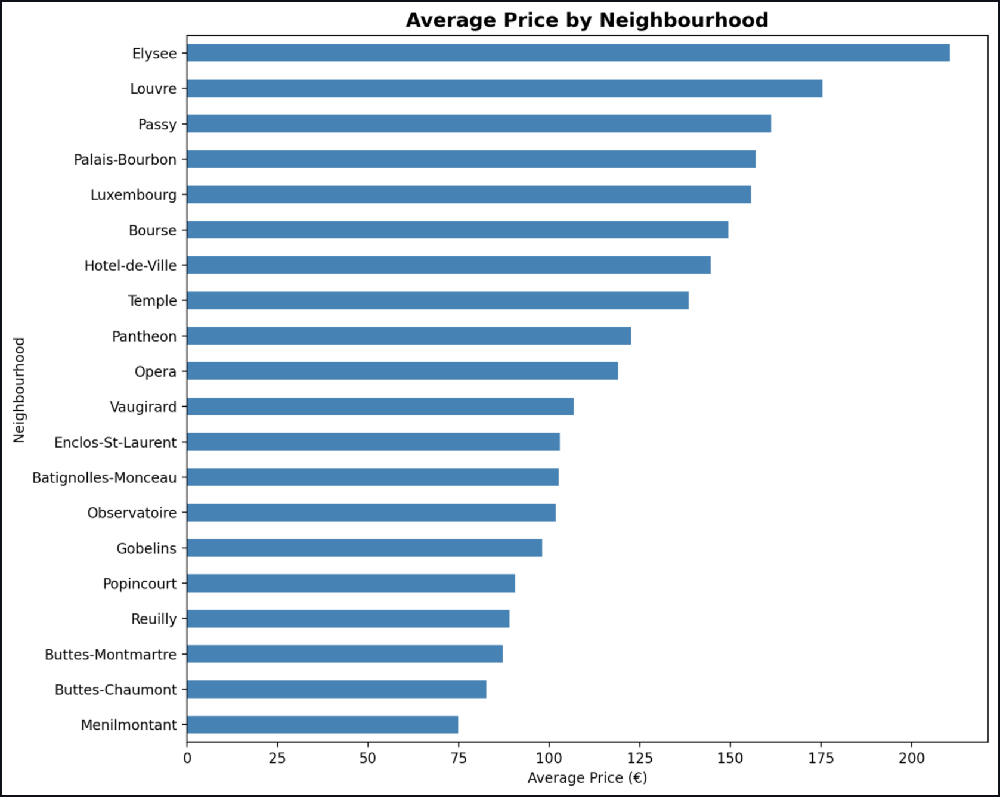
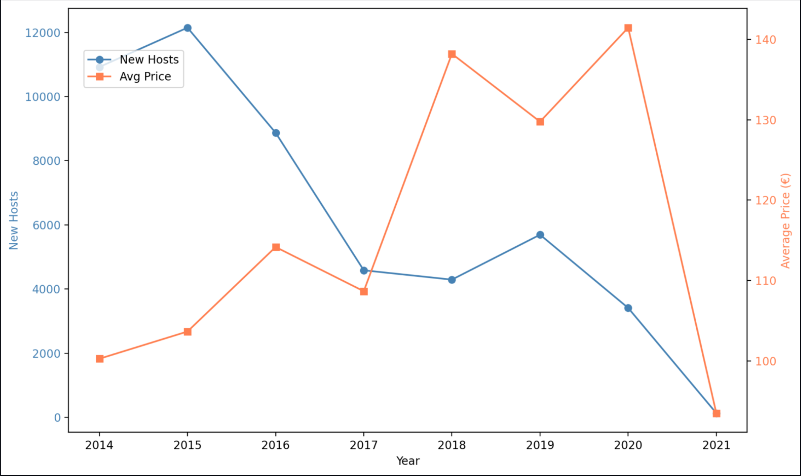
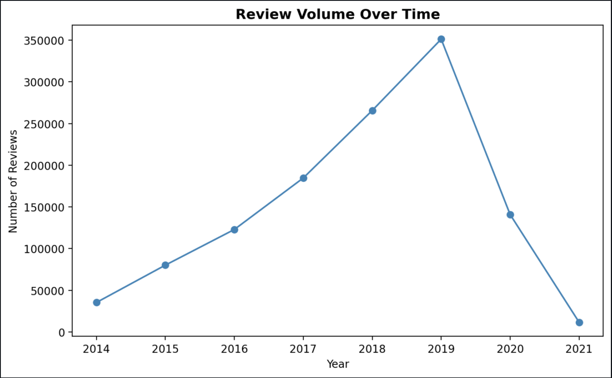

# 🗼 Paris Airbnb Data Analysis & Interactive Dashboard

A data-driven project analyzing Airbnb listings in Paris to uncover pricing patterns, neighbourhood dynamics, and review trends — presented through clear visualizations and an interactive dashboard.

---

## 🎯 Objective

To analyze Airbnb listings in Paris and extract meaningful insights about pricing, accommodation types, and user activity across different neighbourhoods using data analysis and visualization techniques.

---

## 🚀 Key Insights

* Central Paris neighbourhoods command significantly higher average prices compared to outer districts
* Entire homes/apartments dominate the premium pricing segment
* Review activity is heavily concentrated in tourist-dense areas
* Host activity has grown steadily over time, indicating platform expansion

---

## 📊 Dashboard Preview


### 📍 Neighbourhood Pricing


### 📈 Trends Over Time


### ⭐ Review Activity


---

## 🧩 Features

* **Neighbourhood Pricing Analysis**
  Compare average listing prices across Paris neighbourhoods

* **Accommodation Insights**
  Analyze how property size and type influence pricing

* **Temporal Trends**
  Track host growth and pricing changes over time

* **Review Analytics**
  Explore review patterns, most active listings, and engagement by area

* **Interactive Dashboard**
  Interactive dashboard built with Streamlit for exploring key insights

---

## 🏗️ Project Structure

```
paris-airbnb/
├── data/                  # Raw datasets
├── src/
│   ├── analysis.py        # Data cleaning and analysis
│   ├── visuals.py         # Visualization functions
│   ├── main.py            # Execution script
│   └── dashboard.py       # Streamlit app
├── outputs/               # Generated charts and results
├── README.md
├── requirements.txt
└── .gitignore
```

---

## ⚙️ Tech Stack

* **Python** — Core programming language
* **Pandas** — Data manipulation and analysis
* **Matplotlib** — Data visualization
* **Streamlit** — Interactive dashboard development

---

## 📂 Dataset

The dataset contains Airbnb listings and reviews for Paris, including:

* Listing prices
* Neighbourhood information
* Accommodation size and type
* Host activity history
* Review dates and frequency

---

## ▶️ How to Run

1. Clone the repository:

   ```
   git clone <your-repo-link>
   cd paris-airbnb
   ```

2. Install dependencies:

   ```
   pip install -r requirements.txt
   ```

3. Launch the dashboard:

   ```
   streamlit run src/dashboard.py
   ```

---

## 🔮 Future Improvements

* Build a machine learning model to predict listing prices
* Expand analysis to multiple cities
* Deploy the dashboard for public access

---

## 📌 About This Project

This project is part of a growing portfolio focused on data analysis, cloud technologies, and building practical, real-world solutions at the intersection of business and technology.
